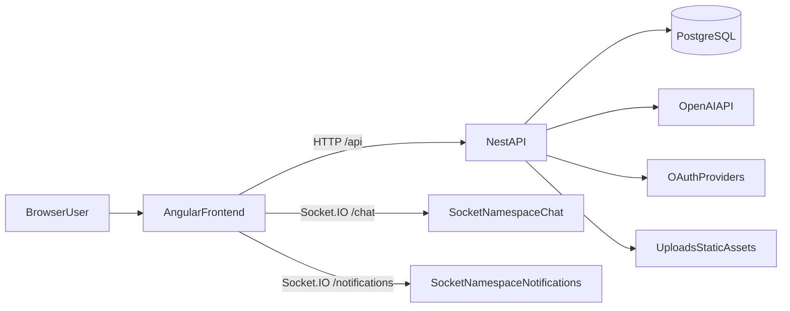
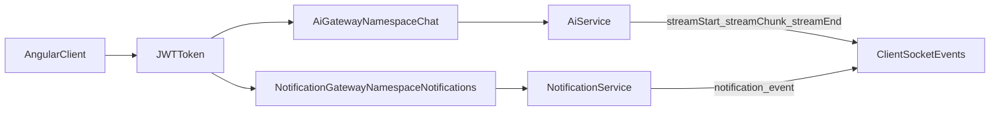

# Project Athena

<p align="center">
  <strong>AI-powered reading platform</strong><br />
  Catalog, reader, AI chat over book content, progress tracking, and admin tools in one full-stack application.
</p>

<p align="center">
  
  
  
  
  
  
  
</p>

## Contents

- [Overview](#overview)
- [Screenshots](#screenshots)
- [Core Capabilities](#core-capabilities)
- [Tech Stack](#tech-stack)
- [Quick Start](#quick-start)
- [System Architecture](#system-architecture)
- [Project Anatomy](#project-anatomy)
- [Integrations](#integrations)
- [Environment Matrix](#environment-matrix)
- [Scripts](#scripts)
- [Troubleshooting](#troubleshooting)
- [Roadmap](#roadmap)

## Overview

`Project Athena` is a full-stack web app for book-driven workflows:
- personal catalog and collections;
- focused reader with progress, bookmarks, and quotes;
- AI summaries and contextual chat over book content;
- realtime notifications and streaming responses;
- admin area for moderation and management.

## Screenshots

<details>
  <summary><strong>Show Landing and Catalog Screenshots</strong></summary>


</details>

<details>
  <summary><strong>Show AI and User Features Screenshots</strong></summary>


</details>

<details>
  <summary><strong>Show Admin and Management Screenshots</strong></summary>


</details>

## Core Capabilities

- 🔐 **Auth and Access**: email/password, JWT access/refresh, Google/GitHub OAuth, role-based guards.
- 📚 **Book Catalog**: cards, details page, collections, favorites, and content management.
- 📖 **Reader Experience**: reading progress, quotes, bookmarks, and personalized reading flow.
- 🤖 **AI Layer**: summaries, RAG-style chunk search, contextual chat via OpenAI.
- ⚡ **Realtime**: Socket.IO namespaces for AI streaming and notifications.
- 🛡️ **Admin Module**: users, books, reviews, dashboard, and moderation flows.

## Tech Stack

### 🎨 Frontend (`frontend`)
- Angular 21 (standalone, lazy routes)
- PrimeNG + PrimeIcons
- Tailwind CSS 4
- RxJS + HTTP Interceptor
- Socket.IO client

### 🧠 Backend (`backend`)
- NestJS 11
- TypeORM + PostgreSQL
- JWT + Passport (local/OAuth strategies)
- OpenAI SDK
- Socket.IO gateways
- class-validator / class-transformer / helmet / cookie-parser

## Quick Start

### 1) Prerequisites

- Node.js 20+
- npm 10+
- PostgreSQL 15+ (local or remote)

### 2) Backend

```bash
cd backend
npm install
copy .env.example .env
```

For macOS/Linux, use:

```bash
cp .env.example .env
```

Fill in required values in `backend/.env` (`DB_*`, `JWT_*`, OAuth keys, `OPENAI_API_KEY`) and run:

```bash
npm run start:dev
```

Backend:
- Base URL: `http://localhost:4000`
- API Prefix: `http://localhost:4000/api`

### 3) Frontend

```bash
cd frontend
npm install
npm start
```

Frontend: `http://localhost:4200`

Dev proxy is already configured in `frontend/proxy.conf.json`:
- `/api` -> `http://localhost:4000`
- `/uploads` -> `http://localhost:4000`

## System Architecture

### 1) High-level architecture



### 2) Backend request flow

```mermaid
flowchart LR
  browser[BrowserRequest]
  nest[NestMainTs]
  guards[GlobalGuardsJwtThrottler]
  pipes[ValidationPipeAndSerializer]
  controller[FeatureController]
  service[DomainService]
  infra[TypeORMOrOpenAIOrGateways]
  response[HTTPResponse]

  browser -->|"/api/*"| nest
  nest --> guards
  guards --> pipes
  pipes --> controller
  controller --> service
  service --> infra
  infra --> response
```



### 3) Realtime flow (AI + notifications)



### 4) Frontend architecture

- `app.routes.ts` defines lazy routes and access boundaries (`guestGuard`, `authGuard`, `adminGuard`).
- `app.config.ts` registers router, HTTP client with `authInterceptor`, PrimeNG theme preset, and global providers.
- `core/` contains application infrastructure: API services, guards, interceptor, models.
- `shared/` contains reusable UI components (navbar, header, footer, book-card, chat-widget, etc.).
- `features/` contains business screens (auth, catalog, reader, profile, collection, admin, landing).

### 5) Backend architecture

- `main.ts` boots the Nest app, middleware (`helmet`, `cookie-parser`), CORS, global `/api` prefix, validation/serialization.
- `app.module.ts` is the composition root: config, TypeORM, throttling, and feature modules.
- Global guards: `JwtAuthGuard` and `ThrottlerGuard`.
- Domain modules: `auth`, `users`, `books`, `reading`, `collection`, `review`, `ai`, `notification`, `admin`.
- WebSocket gateways:
  - `/chat` in `ai/ai.gateway.ts`;
  - `/notifications` in `notification/notification.gateway.ts`.

## Project Anatomy

### Frontend

- [`frontend/src/app/app.routes.ts`](frontend/src/app/app.routes.ts) — top-level routes and guard boundaries.
- [`frontend/src/app/app.config.ts`](frontend/src/app/app.config.ts) — global app configuration.
- [`frontend/src/app/core`](frontend/src/app/core) — API services, guards, interceptor, models.
- [`frontend/src/app/shared`](frontend/src/app/shared) — reusable UI components.
- [`frontend/src/app/features`](frontend/src/app/features) — feature screens/modules.
- [`frontend/src/environments/environment.ts`](frontend/src/environments/environment.ts) — dev `apiUrl` / `wsUrl`.
- [`frontend/proxy.conf.json`](frontend/proxy.conf.json) — local reverse proxy to backend.
- [`frontend/src/styles.scss`](frontend/src/styles.scss) — global design tokens, animations, utilities.

### Backend

- [`backend/src/main.ts`](backend/src/main.ts) — bootstrap and cross-cutting HTTP configuration.
- [`backend/src/app.module.ts`](backend/src/app.module.ts) — root module wiring and infrastructure.
- [`backend/src/config/env.validation.ts`](backend/src/config/env.validation.ts) — fail-fast environment validation.
- [`backend/src/auth`](backend/src/auth) — auth flows, strategies, guards, decorators.
- [`backend/src/ai`](backend/src/ai) — AI REST + streaming gateway.
- [`backend/src/notification`](backend/src/notification) — inbox API + realtime notifications.
- [`backend/src/books`](backend/src/books) — catalog, parsing, book/chunk/summary entities.
- [`backend/src/migrations`](backend/src/migrations) — SQL for indexes and search triggers.

## Integrations

- 🗄️ **PostgreSQL + TypeORM**
  - primary domain data store;
  - `autoLoadEntities` + `synchronize` outside production.
- 🧬 **OpenAI**
  - summary generation;
  - AI chat and book-context processing.
- 🔑 **OAuth providers**
  - Google OAuth 2.0;
  - GitHub OAuth 2.0.
- 📡 **Socket.IO**
  - `/chat` for AI response streaming;
  - `/notifications` for live notification delivery.
- 🖼️ **Static uploads**
  - `/uploads/covers`;
  - `/uploads/avatars`.

## Environment Matrix

All backend variables are validated at startup in [`backend/src/config/env.validation.ts`](backend/src/config/env.validation.ts).

| Variable | Required | Example | Purpose |
|---|---|---|---|
| `PORT` | Yes | `4000` | Backend port |
| `FRONTEND_URL` | Yes | `http://localhost:4200` | CORS origin |
| `DB_HOST` | Yes | `localhost` | PostgreSQL host |
| `DB_PORT` | Yes | `5432` | PostgreSQL port |
| `DB_USERNAME` | Yes | `postgres` | DB user |
| `DB_PASSWORD` | Yes | `secret` | DB password |
| `DB_NAME` | Yes | `athena_ai` | Database name |
| `JWT_ACCESS_SECRET` | Yes | `base64...` | Access token secret |
| `JWT_ACCESS_EXPIRATION` | Yes | `15m` | Access token TTL |
| `JWT_REFRESH_SECRET` | Yes | `base64...` | Refresh token secret |
| `JWT_REFRESH_EXPIRATION` | Yes | `24h` | Refresh token TTL |
| `GOOGLE_CLIENT_ID` | Yes | `...apps.googleusercontent.com` | Google OAuth |
| `GOOGLE_CLIENT_SECRET` | Yes | `...` | Google OAuth |
| `GOOGLE_CALLBACK_URL` | Yes | `http://localhost:4000/api/auth/google/callback` | Google callback |
| `GITHUB_CLIENT_ID` | Yes | `...` | GitHub OAuth |
| `GITHUB_CLIENT_SECRET` | Yes | `...` | GitHub OAuth |
| `GITHUB_CALLBACK_URL` | Yes | `http://localhost:4000/api/auth/github/callback` | GitHub callback |
| `OPENAI_API_KEY` | Yes | `sk-...` | OpenAI integration |

## Scripts

### Frontend (`frontend/package.json`)

```bash
npm start        # ng serve
npm run build    # ng build
npm run watch    # ng build --watch --configuration development
npm test         # ng test
```

### Backend (`backend/package.json`)

```bash
npm run start
npm run start:dev
npm run start:debug
npm run start:prod
npm run build
npm run lint
npm test
npm run test:watch
npm run test:cov
npm run test:e2e
```

## Troubleshooting

### 1) `CORS` / browser blocks requests

- Verify `FRONTEND_URL` in `backend/.env`.
- Ensure frontend runs on expected origin (`http://localhost:4200`).
- Restart backend after changing `.env`.

### 2) `401 Unauthorized` on API calls

- Ensure login completed and tokens are stored on the client.
- Verify interceptor is enabled via `provideHttpClient(withInterceptors([authInterceptor]))`.
- Verify `JWT_ACCESS_SECRET` and `JWT_REFRESH_SECRET`.

### 3) Frontend cannot reach backend locally

- Ensure backend is actually listening on `:4000`.
- Check `frontend/proxy.conf.json` (`/api` and `/uploads` -> `http://localhost:4000`).
- Run frontend with `npm start` so proxy config is applied.

### 4) OAuth callback fails

- Callback URLs in `.env` must match your Google/GitHub app settings.
- Use for local development:
  - `http://localhost:4000/api/auth/google/callback`
  - `http://localhost:4000/api/auth/github/callback`

### 5) PostgreSQL connection errors

- Check `DB_HOST/DB_PORT/DB_USERNAME/DB_PASSWORD/DB_NAME`.
- Ensure database exists and is reachable from backend runtime.

### 6) AI responses do not stream

- Verify `OPENAI_API_KEY`.
- Ensure WebSocket connects to `/chat` namespace.
- Check backend logs for `AiService` errors.

## Roadmap

- Docker Compose for one-command local bootstrap.
- OpenAPI/Swagger docs for external integrations.
- CI pipeline (lint + tests + build).
- Demo seed scripts to speed up onboarding.

## License

MIT (see `backend/package.json`).
