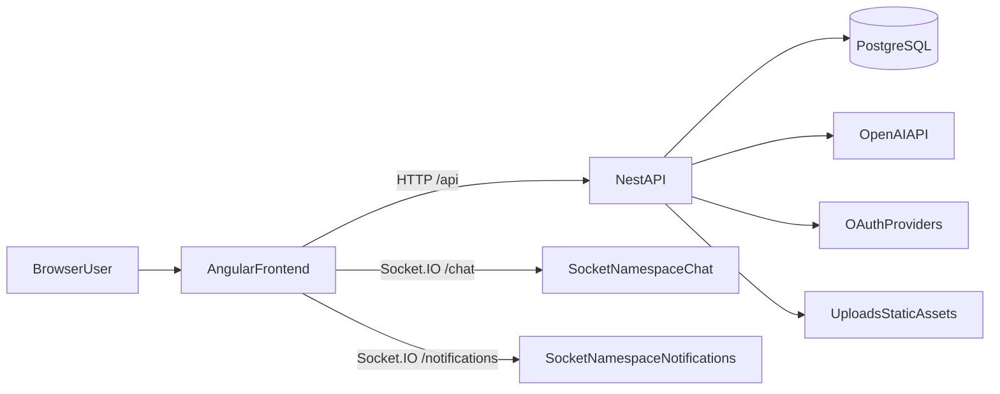
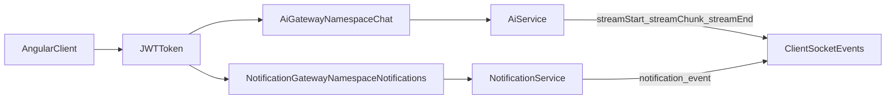

# Project Athena

**AI-powered reading platform**  
Catalog, reader, AI chat over book content, progress tracking, and admin tools in one full-stack application.


## Contents

- [Overview](#overview)
- [Screenshots](#screenshots)
- [Core Capabilities](#core-capabilities)
- [Tech Stack](#tech-stack)
- [Quick Start](#quick-start)
- [Database Setup](#database-setup)
- [System Architecture](#system-architecture)
- [Folder Architecture](#folder-architecture)
- [API Endpoints Tree](#api-endpoints-tree)
- [Project Anatomy](#project-anatomy)
- [Integrations](#integrations)
- [Environment Matrix](#environment-matrix)
- [Security](#security)
- [Scripts](#scripts)
- [Troubleshooting](#troubleshooting)
- [Roadmap](#roadmap)

## Overview

`Project Athena` is a full-stack web app for book-driven workflows:

- personal catalog and collections;
- focused reader with progress, bookmarks, and quotes;
- AI summaries and contextual chat over book content;
- realtime notifications and streaming responses;
- admin area for moderation and management.

## Screenshots

**Show Landing and Catalog Screenshots**

Landing screen
Catalog view
Book details
Collections
Reader page


**Show AI and User Features Screenshots**

AI chat widget
Quotes and bookmarks
Reading progress
Profile page
Authentication flow
Notifications


**Show Admin and Management Screenshots**

Admin dashboard
Admin users
Admin books
Moderation tools


## Core Capabilities

- 🔐 **Auth and Access**: email/password, JWT access/refresh, Google/GitHub OAuth, role-based guards.
- 📚 **Book Catalog**: cards, details page, collections, favorites, and content management.
- 📖 **Reader Experience**: reading progress, quotes, bookmarks, and personalized reading flow.
- 🤖 **AI Layer**: summaries, RAG-style chunk search, contextual chat via OpenAI.
- ⚡ **Realtime**: Socket.IO namespaces for AI streaming and notifications.
- 🛡️ **Admin Module**: users, books, reviews, dashboard, and moderation flows.

## Tech Stack

### 🎨 Frontend (`frontend`)

- Angular 21 (standalone, lazy routes)
- PrimeNG + PrimeIcons
- Tailwind CSS 4
- RxJS + HTTP Interceptor
- Socket.IO client

### 🧠 Backend (`backend`)

- NestJS 11
- TypeORM + PostgreSQL
- JWT + Passport (local/OAuth strategies)
- OpenAI SDK
- Socket.IO gateways
- class-validator / class-transformer / helmet / cookie-parser

## Quick Start

### 1) Prerequisites

- Node.js 20+
- npm 10+
- PostgreSQL 15+ (local or remote)

### 2) Database

Create a PostgreSQL database and user (change credentials if needed):

```sql
CREATE DATABASE athena_ai;
CREATE USER athena_user WITH ENCRYPTED PASSWORD '123123';
GRANT ALL PRIVILEGES ON DATABASE athena_ai TO athena_user;
```

Then set matching values in `backend/.env`:

```env
DB_HOST=localhost
DB_PORT=5432
DB_NAME=athena_ai
DB_USERNAME=athena_user
DB_PASSWORD=123123
```

> Notes:
>
> - In development, schema is created automatically by TypeORM (`synchronize=true` outside production).
> - The app also tries to run `CREATE EXTENSION IF NOT EXISTS vector`; if your PostgreSQL build does not include `pgvector`, install it first.

### 3) Backend

```bash
cd backend
npm install
copy .env.example .env
```

For macOS/Linux, use:

```bash
cp .env.example .env
```

Fill in required values in `backend/.env` (`DB_*`, `JWT_*`, OAuth keys, `OPENAI_API_KEY`) and run:

```bash
npm run start:dev
```

Backend:

- Base URL: `http://localhost:4000`
- API Prefix: `http://localhost:4000/api`

### 4) Frontend

```bash
cd frontend
npm install
npm start
```

Frontend: `http://localhost:4200`

Dev proxy is already configured in `frontend/proxy.conf.json`:

- `/api` -> `http://localhost:4000`
- `/uploads` -> `http://localhost:4000`

## Database Setup

### Option A: local PostgreSQL installation

1. Install PostgreSQL 15+ and ensure `psql` is available.
2. Run:

```bash
psql -U postgres -h localhost -p 5432
```

1. Execute:

```sql
CREATE DATABASE athena_ai;
CREATE USER athena_user WITH ENCRYPTED PASSWORD 'athena_password';
GRANT ALL PRIVILEGES ON DATABASE athena_ai TO athena_user;
```

1. Update `backend/.env` with the same credentials.

### Option B: Docker (quick local DB)

```bash
docker run --name athena-postgres -e POSTGRES_USER=athena_user -e POSTGRES_PASSWORD=athena_password -e POSTGRES_DB=athena_ai -p 5432:5432 -d postgres:16
```

### Verify connection

```bash
psql -U athena_user -h localhost -p 5432 -d athena_ai -c "SELECT current_database(), current_user;"
```

If the query returns database and user, backend can connect with the same `DB_*` values.

## System Architecture

### 1) High-level architecture




### 2) Backend request flow

```mermaid
flowchart LR
  browser[BrowserRequest]
  nest[NestMainTs]
  guards[GlobalGuardsJwtThrottler]
  pipes[ValidationPipeAndSerializer]
  controller[FeatureController]
  service[DomainService]
  infra[TypeORMOrOpenAIOrGateways]
  response[HTTPResponse]

  browser -->|"/api/*"| nest
  nest --> guards
  guards --> pipes
  pipes --> controller
  controller --> service
  service --> infra
  infra --> response
```




### 3) Realtime flow (AI + notifications)




### 4) Frontend architecture

- `app.routes.ts` defines lazy routes and access boundaries (`guestGuard`, `authGuard`, `adminGuard`).
- `app.config.ts` registers router, HTTP client with `authInterceptor`, PrimeNG theme preset, and global providers.
- `core/` contains application infrastructure: API services, guards, interceptor, models.
- `shared/` contains reusable UI components (navbar, header, footer, book-card, chat-widget, etc.).
- `features/` contains business screens (auth, catalog, reader, profile, collection, admin, landing).

### 5) Backend architecture

- `main.ts` boots the Nest app, middleware (`helmet`, `cookie-parser`), CORS, global `/api` prefix, validation/serialization.
- `app.module.ts` is the composition root: config, TypeORM, throttling, and feature modules.
- Global guards: `JwtAuthGuard` and `ThrottlerGuard`.
- Domain modules: `auth`, `users`, `books`, `reading`, `collection`, `review`, `ai`, `notification`, `admin`.
- WebSocket gateways:
  - `/chat` in `ai/ai.gateway.ts`;
  - `/notifications` in `notification/notification.gateway.ts`.

## Folder Architecture

```text
Project-Athena/
├─ frontend/
│  ├─ src/
│  │  ├─ app/
│  │  │  ├─ core/          # infrastructure: API services, guards, interceptors, models
│  │  │  ├─ features/      # business screens: auth, catalog, reader, admin, profile
│  │  │  ├─ shared/        # reusable UI components
│  │  │  ├─ app.config.ts
│  │  │  └─ app.routes.ts
│  │  ├─ environments/
│  │  └─ styles.scss
│  ├─ proxy.conf.json
│  └─ package.json
├─ backend/
│  ├─ src/
│  │  ├─ auth/             # authentication, strategies, guards, tokens
│  │  ├─ users/            # user profile and account logic
│  │  ├─ books/            # catalog, parsing, chunking, summaries
│  │  ├─ reading/          # progress, bookmarks, reading flow
│  │  ├─ collection/       # collections and favorites
│  │  ├─ review/           # reviews and ratings
│  │  ├─ ai/               # OpenAI integration + chat gateway
│  │  ├─ notification/     # inbox APIs + realtime notifications
│  │  ├─ admin/            # moderation and back-office endpoints
│  │  ├─ config/           # env schema and config glue
│  │  ├─ migrations/       # SQL migrations and indexes
│  │  ├─ app.module.ts
│  │  └─ main.ts
│  ├─ uploads/
│  │  ├─ avatars/
│  │  └─ covers/
│  └─ package.json
└─ README.md
```

## API Endpoints Tree

Base API prefix: `/api`

```text
/api
├─ /auth
│  ├─ POST   /register
│  ├─ POST   /login
│  ├─ POST   /refresh
│  ├─ POST   /logout
│  ├─ GET    /google
│  ├─ GET    /google/callback
│  ├─ GET    /github
│  ├─ GET    /github/callback
│  ├─ POST   /oauth/exchange
│  └─ GET    /me
│
├─ /users
│  ├─ GET    /me
│  ├─ PATCH  /me
│  ├─ PATCH  /me/password
│  ├─ PATCH  /me/email
│  ├─ POST   /me/avatar
│  ├─ GET    /
│  ├─ PATCH  /:id/role
│  └─ PATCH  /:id/block
│
├─ /books
│  ├─ GET    /
│  ├─ GET    /:id
│  ├─ GET    /:id/file
│  ├─ GET    /:id/summary
│  ├─ POST   /:id/embeddings
│  ├─ POST   /
│  ├─ PATCH  /:id
│  ├─ PATCH  /:id/cover
│  └─ DELETE /:id
│
├─ /collections
│  ├─ POST   /
│  ├─ GET    /
│  ├─ GET    /:id
│  ├─ PATCH  /:id
│  ├─ DELETE /:id
│  ├─ POST   /:id/books/:bookId
│  └─ DELETE /:id/books/:bookId
│
├─ /books/:bookId/collections
│  └─ GET    /
│
├─ /books/:bookId/reviews
│  ├─ POST   /
│  └─ GET    /
│
├─ /reviews/:id
│  ├─ PATCH  /
│  └─ DELETE /
│
├─ /books/:bookId/progress
│  ├─ PUT    /
│  └─ GET    /
│
├─ /reading
│  ├─ GET    /history
│  └─ GET    /stats
│
├─ /books/:bookId/bookmarks
│  ├─ POST   /
│  └─ GET    /
│
├─ /bookmarks/:id
│  └─ DELETE /
│
├─ /books/:bookId/favorite
│  ├─ POST   /
│  └─ DELETE /
│
├─ /favorites
│  └─ GET    /
│
├─ /books/:bookId/quotes
│  ├─ POST   /
│  └─ GET    /
│
├─ /quotes
│  └─ GET    /
│
├─ /quotes/:id
│  └─ DELETE /
│
├─ /notifications
│  ├─ GET    /
│  ├─ GET    /unread-count
│  ├─ PATCH  /:id/read
│  └─ POST   /read-all
│
├─ /ai
│  ├─ POST   /search
│  ├─ GET    /recommendations/:bookId
│  ├─ POST   /sessions
│  ├─ GET    /sessions
│  ├─ DELETE /sessions/:id
│  ├─ GET    /sessions/:id/messages
│  └─ POST   /sessions/:id/messages
│
└─ /admin
   ├─ GET    /stats
   ├─ GET    /reviews
   └─ DELETE /reviews/:id
```

Realtime namespaces (Socket.IO):
- `/chat`
- `/notifications`

## Project Anatomy

### Frontend

- `[frontend/src/app/app.routes.ts](frontend/src/app/app.routes.ts)` — top-level routes and guard boundaries.
- `[frontend/src/app/app.config.ts](frontend/src/app/app.config.ts)` — global app configuration.
- `[frontend/src/app/core](frontend/src/app/core)` — API services, guards, interceptor, models.
- `[frontend/src/app/shared](frontend/src/app/shared)` — reusable UI components.
- `[frontend/src/app/features](frontend/src/app/features)` — feature screens/modules.
- `[frontend/src/environments/environment.ts](frontend/src/environments/environment.ts)` — dev `apiUrl` / `wsUrl`.
- `[frontend/proxy.conf.json](frontend/proxy.conf.json)` — local reverse proxy to backend.
- `[frontend/src/styles.scss](frontend/src/styles.scss)` — global design tokens, animations, utilities.

### Backend

- `[backend/src/main.ts](backend/src/main.ts)` — bootstrap and cross-cutting HTTP configuration.
- `[backend/src/app.module.ts](backend/src/app.module.ts)` — root module wiring and infrastructure.
- `[backend/src/config/env.validation.ts](backend/src/config/env.validation.ts)` — fail-fast environment validation.
- `[backend/src/auth](backend/src/auth)` — auth flows, strategies, guards, decorators.
- `[backend/src/ai](backend/src/ai)` — AI REST + streaming gateway.
- `[backend/src/notification](backend/src/notification)` — inbox API + realtime notifications.
- `[backend/src/books](backend/src/books)` — catalog, parsing, book/chunk/summary entities.
- `[backend/src/migrations](backend/src/migrations)` — SQL for indexes and search triggers.

## Integrations

- 🗄️ **PostgreSQL + TypeORM**
  - primary domain data store;
  - `autoLoadEntities` + `synchronize` outside production.
- 🧬 **OpenAI**
  - summary generation;
  - AI chat and book-context processing.
- 🔑 **OAuth providers**
  - Google OAuth 2.0;
  - GitHub OAuth 2.0.
- 📡 **Socket.IO**
  - `/chat` for AI response streaming;
  - `/notifications` for live notification delivery.
- 🖼️ **Static uploads**
  - `/uploads/covers`;
  - `/uploads/avatars`.

## Environment Matrix

All backend variables are validated at startup in `[backend/src/config/env.validation.ts](backend/src/config/env.validation.ts)`.


| Variable                 | Required | Example                                          | Purpose              |
| ------------------------ | -------- | ------------------------------------------------ | -------------------- |
| `PORT`                   | Yes      | `4000`                                           | Backend port         |
| `FRONTEND_URL`           | Yes      | `http://localhost:4200`                          | CORS origin          |
| `DB_HOST`                | Yes      | `localhost`                                      | PostgreSQL host      |
| `DB_PORT`                | Yes      | `5432`                                           | PostgreSQL port      |
| `DB_USERNAME`            | Yes      | `postgres`                                       | DB user              |
| `DB_PASSWORD`            | Yes      | `secret`                                         | DB password          |
| `DB_NAME`                | Yes      | `athena_ai`                                      | Database name        |
| `JWT_ACCESS_SECRET`      | Yes      | `base64...`                                      | Access token secret  |
| `JWT_ACCESS_EXPIRATION`  | Yes      | `15m`                                            | Access token TTL     |
| `JWT_REFRESH_SECRET`     | Yes      | `base64...`                                      | Refresh token secret |
| `JWT_REFRESH_EXPIRATION` | Yes      | `24h`                                            | Refresh token TTL    |
| `GOOGLE_CLIENT_ID`       | Yes      | `...apps.googleusercontent.com`                  | Google OAuth         |
| `GOOGLE_CLIENT_SECRET`   | Yes      | `...`                                            | Google OAuth         |
| `GOOGLE_CALLBACK_URL`    | Yes      | `http://localhost:4000/api/auth/google/callback` | Google callback      |
| `GITHUB_CLIENT_ID`       | Yes      | `...`                                            | GitHub OAuth         |
| `GITHUB_CLIENT_SECRET`   | Yes      | `...`                                            | GitHub OAuth         |
| `GITHUB_CALLBACK_URL`    | Yes      | `http://localhost:4000/api/auth/github/callback` | GitHub callback      |
| `OPENAI_API_KEY`         | Yes      | `sk-...`                                         | OpenAI integration   |

## Security

- **Authentication and authorization**
  - JWT access/refresh tokens with role-based guards (`guest`, `user`, `admin` boundaries).
  - OAuth providers (Google/GitHub) for trusted external identity flows.
- **Input validation**
  - DTO validation with `class-validator` and transformation via `class-transformer`.
  - Fail-fast environment validation in `backend/src/config/env.validation.ts`.
- **HTTP hardening**
  - `helmet` security headers are enabled at bootstrap.
  - CORS restricted by `FRONTEND_URL`; credentials handling is explicit.
- **Rate limiting and abuse protection**
  - Global throttling via Nest throttler guard for API endpoints.
  - Auth and AI-heavy routes should keep stricter limits in production.
- **Secrets and operational safety**
  - Store all secrets only in environment variables, never in git-tracked files.
  - Rotate `JWT_*`, OAuth secrets, and `OPENAI_API_KEY` on schedule or incident.
- **Production checklist**
  - Disable TypeORM `synchronize` in production.
  - Run with HTTPS only (TLS termination on gateway/reverse proxy).
  - Keep dependencies patched and run `npm audit` regularly.


## Scripts

### Frontend (`frontend/package.json`)

```bash
npm start        # ng serve
npm run build    # ng build
npm run watch    # ng build --watch --configuration development
npm test         # ng test
```

### Backend (`backend/package.json`)

```bash
npm run start
npm run start:dev
npm run start:debug
npm run start:prod
npm run build
npm run lint
npm test
npm run test:watch
npm run test:cov
npm run test:e2e
```

## Troubleshooting

### 1) `CORS` / browser blocks requests

- Verify `FRONTEND_URL` in `backend/.env`.
- Ensure frontend runs on expected origin (`http://localhost:4200`).
- Restart backend after changing `.env`.

### 2) `401 Unauthorized` on API calls

- Ensure login completed and tokens are stored on the client.
- Verify interceptor is enabled via `provideHttpClient(withInterceptors([authInterceptor]))`.
- Verify `JWT_ACCESS_SECRET` and `JWT_REFRESH_SECRET`.

### 3) Frontend cannot reach backend locally

- Ensure backend is actually listening on `:4000`.
- Check `frontend/proxy.conf.json` (`/api` and `/uploads` -> `http://localhost:4000`).
- Run frontend with `npm start` so proxy config is applied.

### 4) OAuth callback fails

- Callback URLs in `.env` must match your Google/GitHub app settings.
- Use for local development:
  - `http://localhost:4000/api/auth/google/callback`
  - `http://localhost:4000/api/auth/github/callback`

### 5) PostgreSQL connection errors

- Check `DB_HOST/DB_PORT/DB_USERNAME/DB_PASSWORD/DB_NAME`.
- Ensure database exists and is reachable from backend runtime.

### 6) AI responses do not stream

- Verify `OPENAI_API_KEY`.
- Ensure WebSocket connects to `/chat` namespace.
- Check backend logs for `AiService` errors.

## Roadmap

- Docker Compose for one-command local bootstrap.
- OpenAPI/Swagger docs for external integrations.
- CI pipeline (lint + tests + build).
- Demo seed scripts to speed up onboarding.

## License

MIT (see `backend/package.json`).